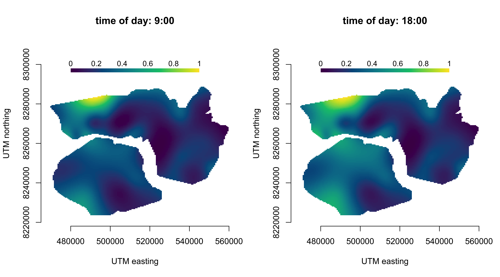

<!-- README.md is generated from README.Rmd. Please edit that file -->

```{r, include = FALSE}
knitr::opts_chunk$set(
  collapse = TRUE,
  comment = "#>"
)
```

# Tensor-product interactions in Markov-switching models

This repository provides code to reproduce the case studies presented in the paper ["Tensor-product interactions in Markov-switching models"](https://arxiv.org/abs/2507.01555).

In the paper I discuss incorporating tensor-product interactions into Markov-switching models to capture complex temporal and spatial patterns in animal movement and behaviour data. The approach allows for flexible modelling of time-varying effects, enabling the analysis of intricate relationships between multiple covariates over time and space. Efficient anisotropic smoothness selection is conducted approximately using the so-called *extended Fellner-Schall method*.

The methodology is illustrated through three applied case studies analysing

1) diel variation of an African elephant across the annual cycle, 
2) genotype-specific behavioural rhythms in fruit flies, and
3) time-varying spatial effects in Arctic muskox movement data.

Code for reproducing all results can be found in the `case_studies` directory.


